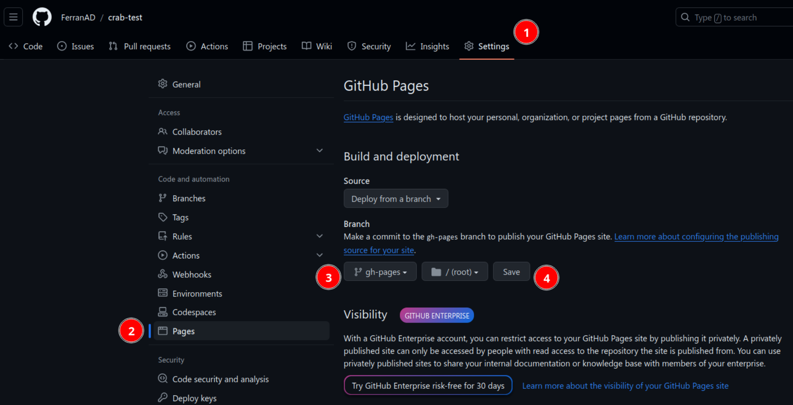
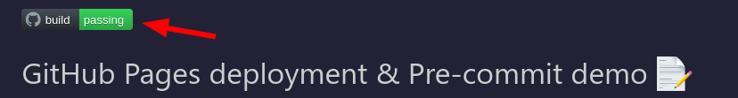

[](https://github.com/FerranAD/crab-test/actions/workflows/deploy.yml)

# GitHub Pages deployment & Pre-commit demo 📝

This project demonstrates how to set up a simple GitHub repository with an [MkDocs](https://www.mkdocs.org/) website hosted on GitHub Pages while using [pre-commit](https://pre-commit.com/) to ensure standard commits are used and also run python linters. The deployment is automated with a GitHub Actions workflow, and a build badge is displayed on the README.

## Getting Started

### Prerequisites

Before following the steps below, it is recommended to create a [python virtual environment](https://docs.python.org/3/library/venv.html) to isolate the dependencies of this project from the rest of your system. This can be done by running the following command:

```bash
python -m venv .venv
```

After creating the virtual environment, it is necessary to activate it. This can be done by running the following command:

```bash
source .venv/bin/activate
```

### Setting up pre-commit

To start using pre-commit hooks on your project, you'll need to first copy some files:

- `.github/dev-requirements.txt`
- `.pre-commit-config.yaml`
- `commitlint.config.js`

And then run the following commands:

```
pip install -r .github/dev-requirements.txt
sudo npm install -g @commitlint/{config-conventional,cli}
pre-commit install && pre-commit autoupdate && pre-commit install --hook-type commit-msg
```

> **Note:** If your PC doesn't have `npm`, check out [how to install NPM](https://docs.npmjs.com/downloading-and-installing-node-js-and-npm).

### Setting up MkDocs

To start developing the website, you'll need to install the dependencies and copy an initial `mkdocs.yml`, which is the configuration file for your MkDocs website. Copy the `requirements.txt` and `mkdocs.yml` files to your project and run the following command:

```bash
pip install -r requirements.txt
```


### Local Development

When developing the website locally, it is useful to use the below command to run the website on your local machine and see the changes in real-time. This can be done by running the following command:

```bash
mkdocs serve
```

### Building the website

All your website content will reside inside the `docs` folder. So to get started, you can create a new markdown file inside the `docs` folder and add some content to it.

### Adding Github Actions to automate website deployment


### Creating GitHub Pages

In order to make Github deploy our website to Github Pages every time we push something new to the repo, a Workflow is needed. So to get started copy `.github/workflows/deploy.yml` to your project.

Once that is done, we need to tell Gihtub about our website, to achieve that:

1. Go to the "Settings" tab of your GitHub repository.
2. Scroll down to the "Pages" section.
3. Select the branch you want to use for GitHub Pages deployment (in this case `gh-pages`).
5. Save the changes.



Great! Now every time a new commit is pushed the new changes will be available at `https://YOUR_GITHUB_USERNAME.github.io/YOUR_GITHUB_REPO_NAME/`. Dont forget to substitute `YOUR_GITHUB_USERNAME` and `YOUR_GITHUB_REPO_NAME` for their actual values, for example, in this repo that would be
[https://ferranad.github.io/crab-test](https://ferranad.github.io/crab-test/).

### Obtaining Build Badge for your README

1. Go to the Actions tab of your GitHub repository.
2. Click on the `build` workflow.
3. Click on the three dots button on the upper right and choose 'Create status badge' option.
4. Copy the markdown code and add it to `README.md`


If you have followed all the steps correctly, you should see a badge like this one at the top of your README:

