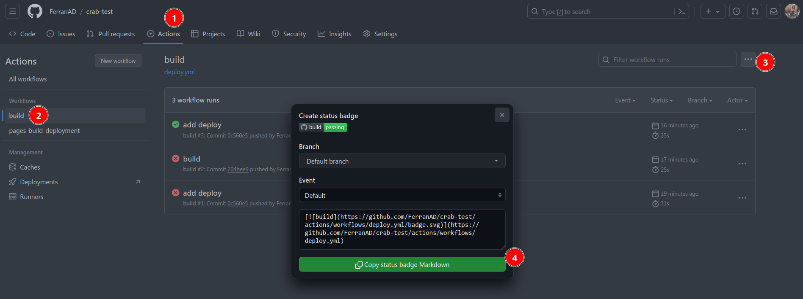

# GitHub Pages deployment & Pre-commit demo 📝

WThis project demonstrates how to set up a simple GitHub repository with a MKDocs website hosted on GitHub Pages while using pre-commit to ensure standard commits are used and also run python linters. The deployment is automated with a GitHub Actions workflow, and a build badge is displayed on the README.

## Getting Started

### Setting up pre-commit

To start using pre-commit hooks on your project, you'll need to first copy some files:

- `.github/dev-requirements.txt`
- `.pre-commit-config.yaml`
- `commitlint.config.js`

And then run the following commands:

```
pip install -r .github/dev-requirements.txt
sudo npm install -g @commitlint/{config-conventional,cli}
pre-commit install && pre-commit autoupdate && pre-commit install --hook-type commit-msg
```

> **Note:** If your PC doesn't have `npm`, check out [how to install NPM](https://docs.npmjs.com/downloading-and-installing-node-js-and-npm).

### Local Development

When developing the website locally, it is useful to use the below command to run the website on your local machine:

```bash
mkdocs serve
```

### Adding Github Actions to automate website deployment


### Creating GitHub Pages

In order to make Github deploy our website to Github Pages every time we push something new to the repo, a Workflow is needed. So to get started copy `.github/workflows/deploy.yml` to your project.

Once that is done, we need to tell Gihtub about our website, to achieve that:

1. Go to the "Settings" tab of your GitHub repository.
2. Scroll down to the "Pages" section.
3. Select the branch you want to use for GitHub Pages deployment (in this case `gh-pages`).
5. Save the changes.


Great! Now every time a new commit is pushed the new changes will be available at `https://YOUR_GITHUB_USERNAME.github.io/YOUR_GITHUB_REPO_NAME/`. Dont forget to substitute `YOUR_GITHUB_USERNAME` and `YOUR_GITHUB_REPO_NAME` for their actual values, for example, in this repo that would be
[https://ferranad.github.io/crab-website](https://ferranad.github.io/crab-website/).

### Obtaining Build Badge Markdown

1. Go to the Actions tab of your GitHub repository.
2. Click on the `build` workflow.
3. Click on the three dots button on the upper right and choose 'Create status badge' option.
4. Copy the markdown code and add it to `README.md`



